# Fakieh Order System — Operator Guide

**Audience:** Plant operators  
**Purpose:** Explain how orders work end-to-end, with clear diagrams for training  
**Screens used:** Live Orders · Order History · Truck Entry · Weighbridge  

---

## 1. What this system does (in plain language)

This is a **plant material-handling order system**, not a shop or invoice system.

Operators create orders for:

| Order family | What it does | Physical lines |
|--------------|--------------|----------------|
| **Intake** | Receive raw material into silos | Intake Line 1, Intake Line 2 |
| **Mineral** | Receive mineral material into mineral silos | Mineral Line 3 |
| **Outloading** | Send material out (Bulk or Packing) | Outloading 1, 2, 3 |
| **Bulk** | Move material between silos on the bulk line | Bulk line |
| **PIT** | Pit intake into destination silos | PIT line |
| **Truck weigh** | Capture entry/exit truck weights | Weighbridge (separate from PLC queue) |

**Important rule:** The PLC can run **only one order per physical line at a time**. Extra orders wait in a **queue** until the line is free and (for RFID lines) the correct badge is scanned.

### Live Orders status bar (operators)

| Indicator / control | Meaning |
|---------------------|---------|
| **PLC orders: Running** | Backend live PLC stream is on (always started with the server — operators cannot stop it) |
| **Live PLC Data (5s updates)** | This page also refreshes order/queue data every 5 seconds |
| **Refresh** | Manual reload of the live table now |

There is **no Start/Stop Broadcast button**. The live feed stays running continuously after backend startup.

---

## 2. Big picture — how everything connects

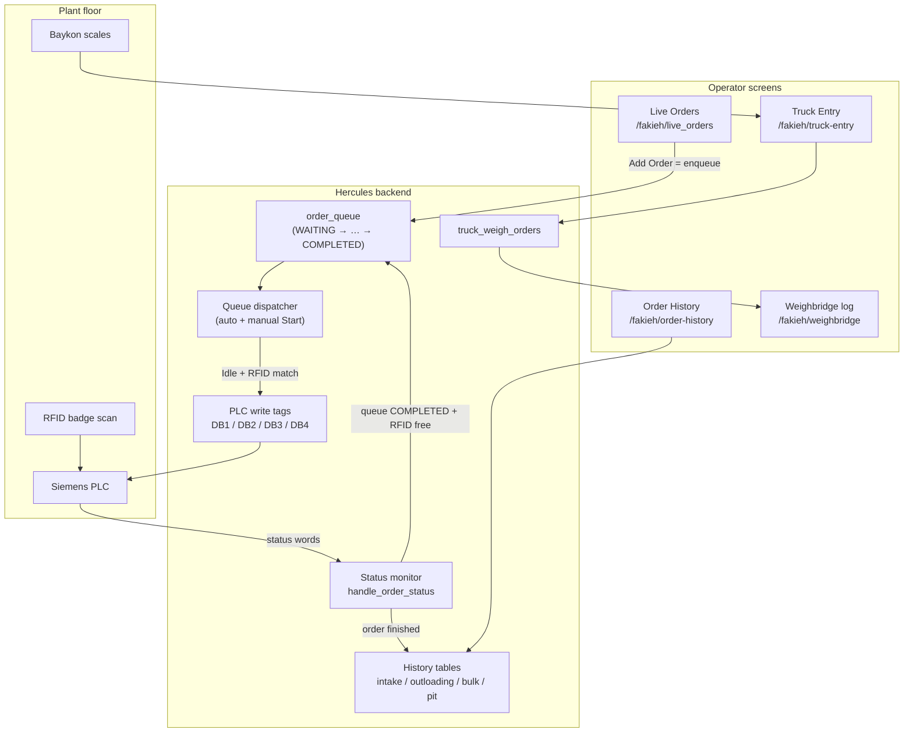

---

## 3. Where to work in the UI

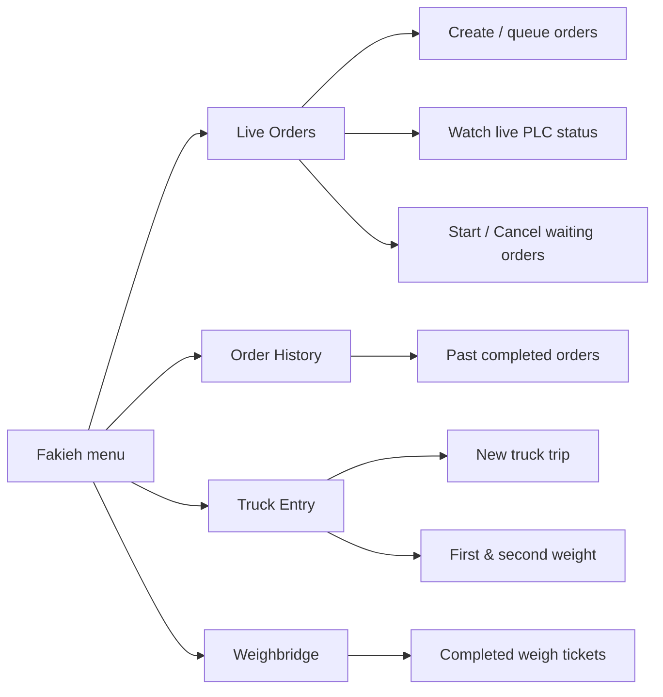

| Screen | When to use it |
|--------|----------------|
| **Live Orders** | Create plant orders, see waiting queue, see what the PLC is doing now. Live PLC stream is always on (status only; no Start/Stop). |
| **Order History** | Look up finished plant orders later |
| **Truck Entry** | Start a weighbridge trip and save entry/exit weights |
| **Weighbridge** | Review completed truck weigh tickets |

---

## 4. Order types and lines (plant map)

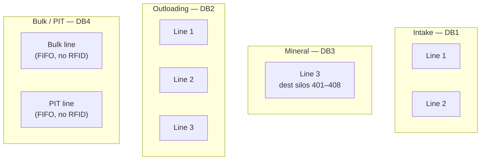

| Tab on Live Orders | Queue type | PLC DB | RFID required? |
|--------------------|------------|--------|----------------|
| Intake Line 1 | `intake` | DB1 line 1 | Yes |
| Intake Line 2 | `intake` | DB1 line 2 | Yes |
| Mineral Intake | `mineral` | DB3 line 3 | Yes |
| Outloading 1 / 2 / 3 | `outloading` | DB2 line 1/2/3 | Yes |
| Bulk Line | `bulk` | DB4 | No (FIFO) |
| PIT Line | `pit` | DB4 | No (FIFO) |

---

## 5. How to create a plant order (step by step)

### 5.1 Operator steps on Live Orders

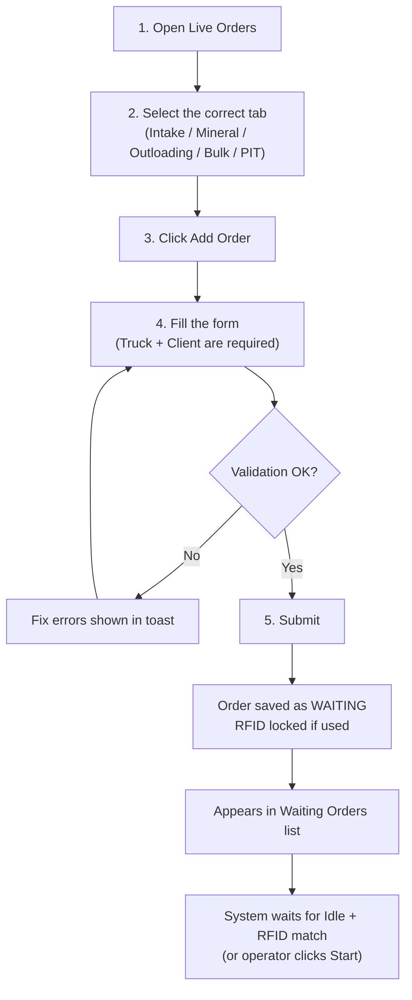

### 5.2 What you fill in (by order type)

#### Intake / Mineral / Outloading

| Field | Required | Notes |
|-------|----------|-------|
| **Truck** | Yes | Must select a truck |
| **Client Name** | Yes | Must select a client |
| **Badge / RFID** | Yes (intake / mineral / outloading) | Badge used to match when truck is scanned |
| **Source material** | Yes | Material code + name |
| **Declared quantity (kg)** | Yes | Planned weight |
| **Destination Silo 1 / 2** | At least one | Destination bins |
| **Destination (Bulk / Packing)** | Outloading only | **0 = Bulk**, **1 = Packing** |

#### Bulk

| Field | Notes |
|-------|-------|
| Truck, Client | Required |
| Source silo | Required before dest silos show |
| Dest silo 1 / 2 | Destination routing |
| Declared qty (kg) | Planned weight |
| CC25 select, Scale select | Line options |

#### PIT

| Field | Notes |
|-------|-------|
| Truck, Client | Required |
| Pit number | Which pit |
| Raw material code | Required before dest silos show |
| Dest silo 1 / 2 | Destinations |
| Declared qty (kg), Scale select | Weight / scale options |

### 5.3 What happens after you click Submit

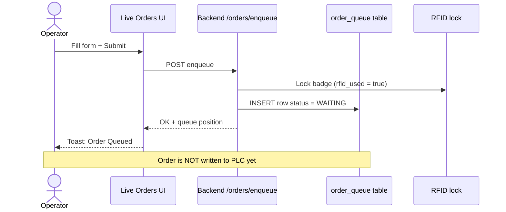

**Key point for operators:**  
**Add Order = put in waiting list.**  
It does **not** start the machine immediately. The PLC starts only when:

1. That line is **Idle**, and  
2. For RFID lines: the **scanned RFID matches** the order’s badge, **or**  
3. You press **Start** on that waiting order (manual).

---

## 6. Queue lifecycle (WAITING → COMPLETED)

### 6.1 Status meanings (operator view)

| Queue status | Meaning | What operator sees / does |
|--------------|---------|---------------------------|
| **WAITING** | In queue, not on PLC yet | Can **Start** or **Cancel** |
| **DISPATCHED** | Written to PLC, waiting process start | Can **Cancel** (clears tags); RFID still locked |
| **RUNNING** | PLC is processing (status Starting/Running/…) | Wait for plant to finish |
| **COMPLETED** | Finished; saved to history; RFID released | Appears in Order History |
| **CANCELLED** | Stopped by operator; RFID released | Removed from active work |

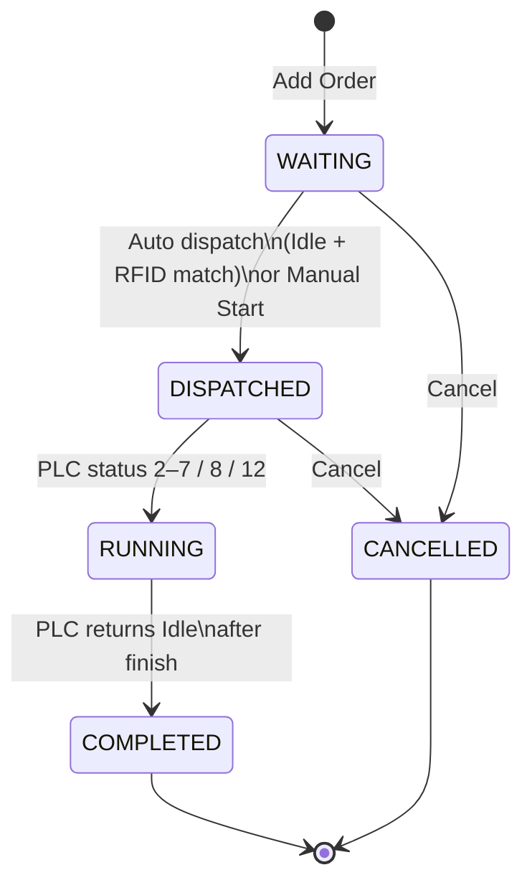

### 6.2 Auto dispatch (normal plant flow)

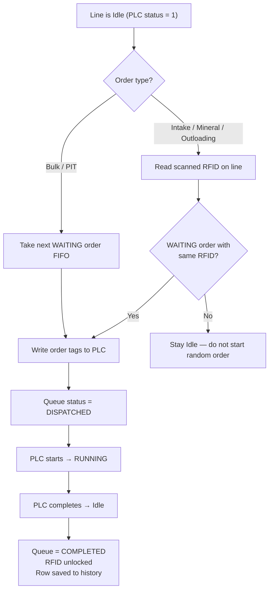

### 6.3 Manual Start / Cancel

On the **Waiting Orders** list:

- **Start** — force dispatch of that waiting order (when allowed; line should be Idle).
- **Cancel** — remove WAITING or DISPATCHED order; unlock RFID; if already dispatched, clear PLC tags.

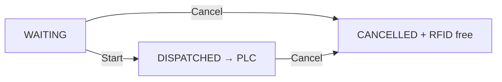

---

## 7. PLC status words (what the live table shows)

While an order is on the line, the Live Orders table shows the **PLC status**, not only the queue status.

| Code | Label | Kind | Typical meaning |
|-----:|-------|------|-----------------|
| 0 | No Status | Inactive | Nothing meaningful yet |
| 1 | Idle | Idle | Line free — ready for next order |
| 2 | Starting | Active | Process starting |
| 6 | Running | Active | Process running |
| 8 | Stopping | Warn | Process stopping / finishing |
| 12 | Completed | Success | Cycle completed |

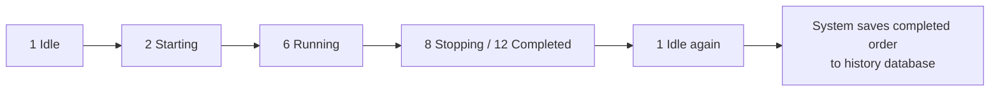

**When is the order saved permanently?**  
Only after the PLC finishes and returns to **Idle**. Then Hercules writes a completed row into history (`intake_orders`, `outloading_orders`, `bulk_line_orders`, or `pt_line_orders`).

---

## 8. Full create → finish journey (one diagram)

Use this when explaining a full truck/intake or outloading cycle to a new operator:

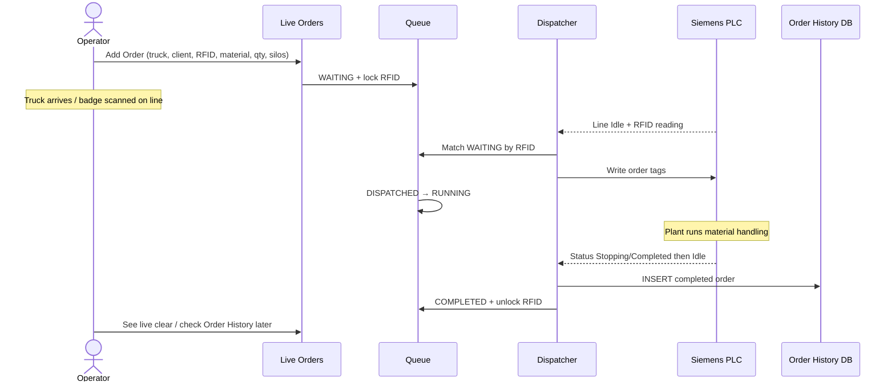

---

## 9. Special rules operators must know

### 9.1 One active order per line

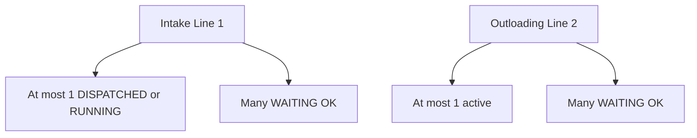

You may queue many orders. Only one runs on that line.

### 9.2 RFID lock

- When an order is WAITING / DISPATCHED / RUNNING, its **RFID cannot be used on another order**.
- When the order completes or is cancelled, the RFID is **released**.

### 9.3 Mineral destinations

- Mineral orders must use destination silos **401–408**.
- Wrong range → form rejects with a clear message.

### 9.4 Outloading destination selection

| UI choice | Value | Meaning |
|-----------|------:|---------|
| Bulk | 0 | Route to bulk |
| Packing | 1 | Route to packing |

### 9.5 Outloading silo picker rules

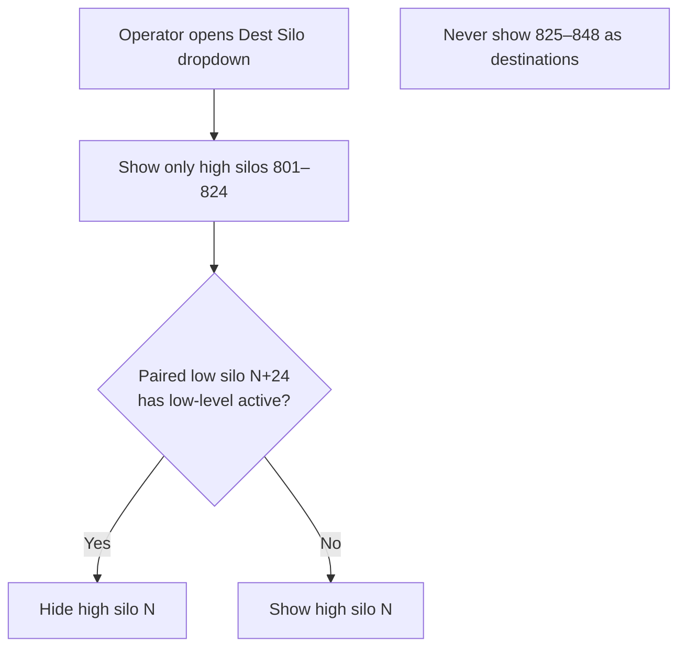

Example pairing: **801 ↔ 825**, **802 ↔ 826**, … (offset +24).

### 9.6 Silo HL / LOCK

If a destination is blocked by high-level or lock sensors, create/write can be rejected. Fix silo condition or choose another destination.

### 9.7 Truck + Client always required

Live Orders will not accept an order without both **Truck** and **Client**.

---

## 10. How to create an outloading order (example walkthrough)

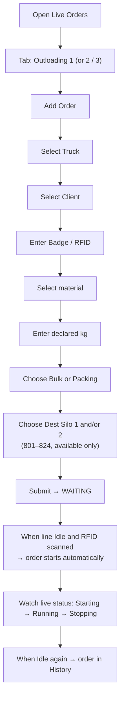

---

## 11. How to create an intake / mineral order (example)

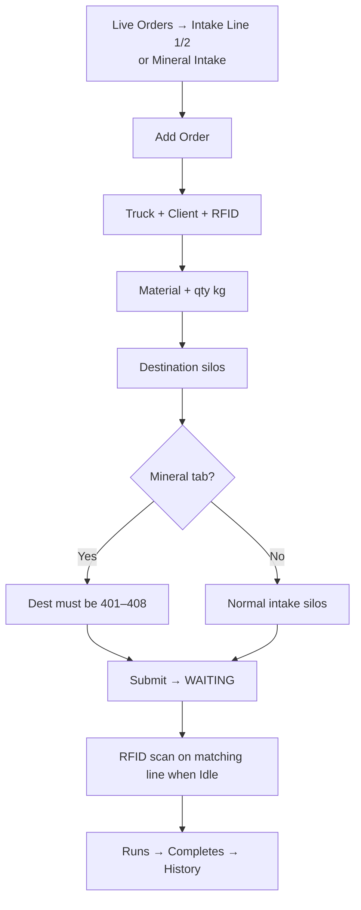

---

## 12. Bulk and PIT (no RFID match)

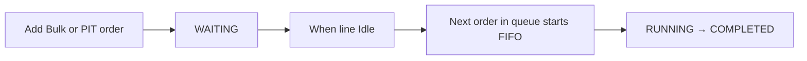

Unlike intake/outloading, Bulk and PIT do **not** wait for an RFID match. They start in queue order when the line is free (or when you press Start).

---

## 13. Truck weighbridge orders (separate system)

Plant PLC orders and weighbridge trips are **related in operations** (same truck/material idea) but stored separately.

### 13.1 Weigh trip lifecycle

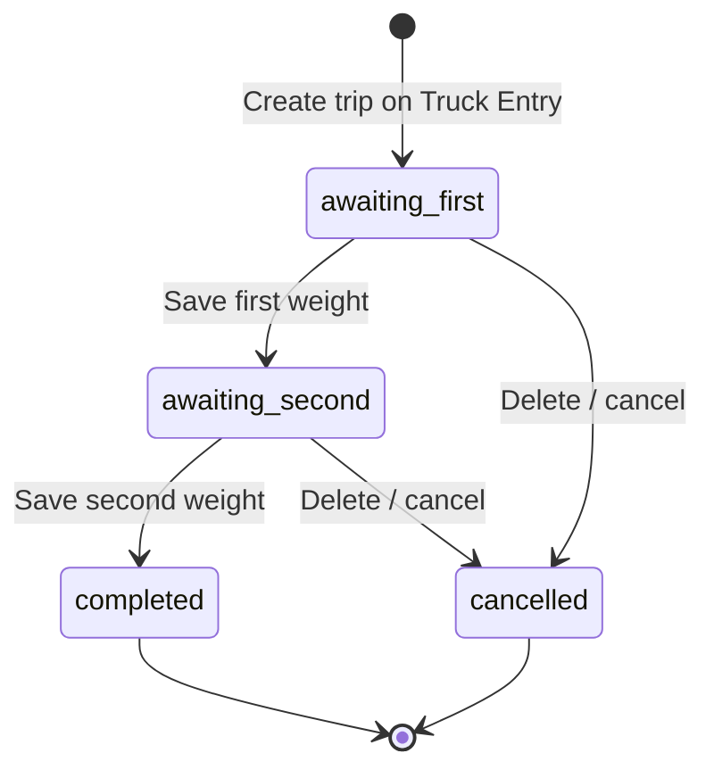

### 13.2 Operator steps

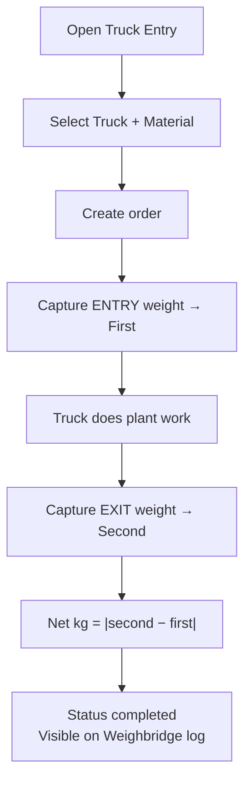

### 13.3 Rules

| Rule | Detail |
|------|--------|
| One open trip per truck | Cannot create a second open weigh order for the same truck |
| Net weight | Absolute difference of first and second weights |
| Cancel | Only open trips (`awaiting_first` / `awaiting_second`) |

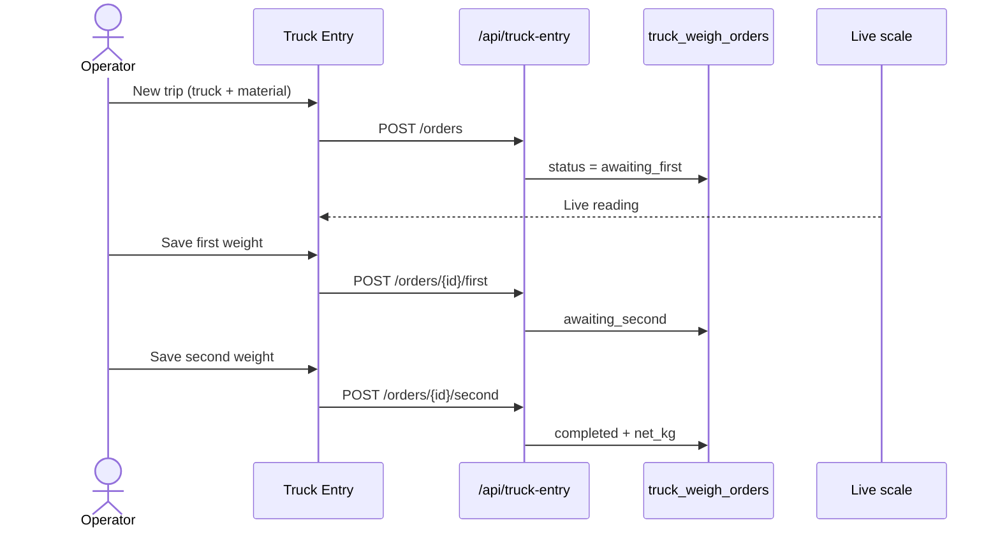

---

## 14. Order History

After a plant order completes:

1. Queue status becomes **COMPLETED**
2. A permanent row is stored in the matching history table
3. Operator can open **Order History** to filter/search past orders
4. History can be deleted from the history screen if needed (admin/operations practice)

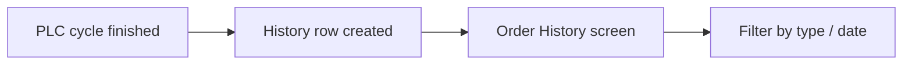

---

## 15. Master data used by orders

Orders link to existing plant records:

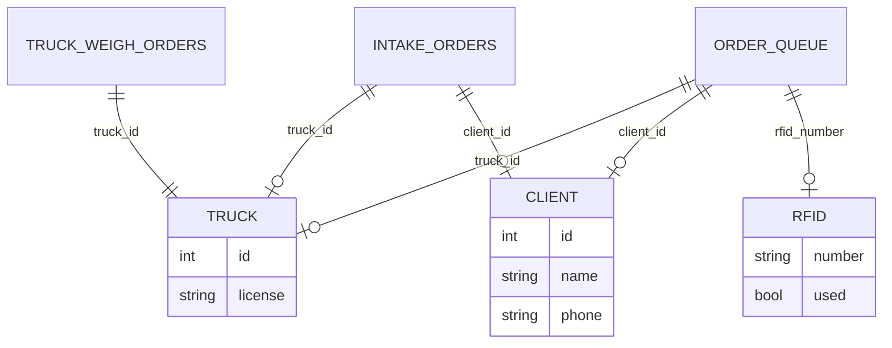

Before creating orders, ensure:

- Trucks exist in **Truck Management**
- Clients exist in **Client Information**
- RFID badges are configured and not already locked to another open order
- Materials / silos are available (not HL/LOCK blocked where applicable)

---

## 16. Troubleshooting for operators

| Symptom | Likely cause | What to do |
|---------|--------------|------------|
| Order stays WAITING | Line busy, or RFID not scanned / mismatch | Wait for Idle; confirm correct badge on correct line; or use **Start** if allowed |
| “RFID already in use” | Badge locked to another open order | Finish or cancel the other order |
| Cannot select silo | HL/LOCK or outloading low-pair rule | Pick another silo; check silo status |
| Mineral create fails | Dest not in 401–408 | Fix destinations |
| Outloading create fails | Bulk/Packing not chosen | Set Destination to Bulk (0) or Packing (1) |
| Truck create fails on weigh | Truck already has open trip | Complete or cancel the open weigh order |
| History empty after run | Cycle did not return to Idle / not finished | Confirm PLC reached Stopping/Completed then Idle |

```mermaid
flowchart TD
  A["Order not starting?"] --> B{"Line Idle?"}
  B -->|No| C["Wait for current order to finish"]
  B -->|Yes| D{"RFID line?"}
  D -->|Yes| E{"Scanned RFID = order RFID?"}
  E -->|No| F["Scan correct badge or check badge on order"]
  E -->|Yes| G["Check dispatcher / try Manual Start"]
  D -->|No Bulk/PIT| H["Should FIFO start — check queue position / Start"]
```

---

## 17. Two systems side by side (training summary)

```mermaid
flowchart TB
  subgraph PlantOrders["Plant Live Orders"]
    P1["Enqueue WAITING"]
    P2["Dispatch to PLC"]
    P3["Run on line"]
    P4["Save to Order History"]
  end

  subgraph Weigh["Truck Entry / Weighbridge"]
    W1["Create trip"]
    W2["First weight"]
    W3["Second weight"]
    W4["Completed ticket"]
  end

  PlantOrders -.->|"Same truck may do both<br/>but separate records"| Weigh
```

| | Live plant order | Weighbridge trip |
|--|------------------|------------------|
| Screen | Live Orders | Truck Entry |
| Starts machine? | Yes (via PLC) | No — only records weights |
| Queue? | Yes | No (one open per truck) |
| RFID match? | Yes for intake/mineral/outloading | No |
| Final record | Order History | Weighbridge log |

---

## 18. Quick cheat sheet (print this page)

### Create plant order
1. Live Orders → correct tab  
2. **Add Order**  
3. Truck + Client + (RFID if needed) + material + qty + silos (+ Bulk/Packing for outloading)  
4. Submit → **WAITING**  
5. When Idle + RFID match → runs automatically  
6. Finished → **Order History**

### Cancel plant order
- Waiting / Dispatched → **Cancel** on queue row → RFID freed  

### Create weigh trip
1. Truck Entry → truck + material → create  
2. Save first weight  
3. Save second weight → net calculated → Weighbridge log  

### Never forget
- One running order **per line**  
- Add Order ≠ start machine (it queues)  
- RFID locked until complete/cancel  
- Truck + Client required on Live Orders  

---

## 19. Visual: end-to-end operator day (example)

```mermaid
flowchart TD
  subgraph Morning["Morning"]
    M1["Prepare trucks & clients in master data"]
    M2["Queue several intake / outloading orders"]
  end

  subgraph Gate["Gate / Weighbridge"]
    G1["Truck Entry: create trip + first weight"]
  end

  subgraph Plant["Plant lines"]
    P1["Truck RFID scanned on Idle line"]
    P2["Matching WAITING order starts"]
    P3["Operator watches Live Orders status"]
    P4["Order completes → history saved"]
  end

  subgraph Exit["Exit"]
    X1["Truck Entry: second weight"]
    X2["Net kg on Weighbridge log"]
  end

  M1 --> M2 --> G1 --> P1 --> P2 --> P3 --> P4 --> X1 --> X2
```

---

## 20. Related technical docs (for supervisors / IT)

| Document | Content |
|----------|---------|
| `docs/LIVE_ORDER_WORKFLOW_PLAN.md` | Original queue design spec |
| `docs/OUTLOADING_ORDERS_UPDATE.md` | Bulk/Packing + silo rules |
| `docs/TRUCK_ENTRY_WEIGHBRIDGE_PLAN.md` | Weighbridge plan |
| `ORDER_COMPLETE_AND_PLC_MONITORING.md` | Completion + PLC monitoring |

---

*Document generated for operator training. Screenshots can be added next to each “Add Order” / “Waiting Orders” / “Truck Entry” section if needed for classroom printouts.*
