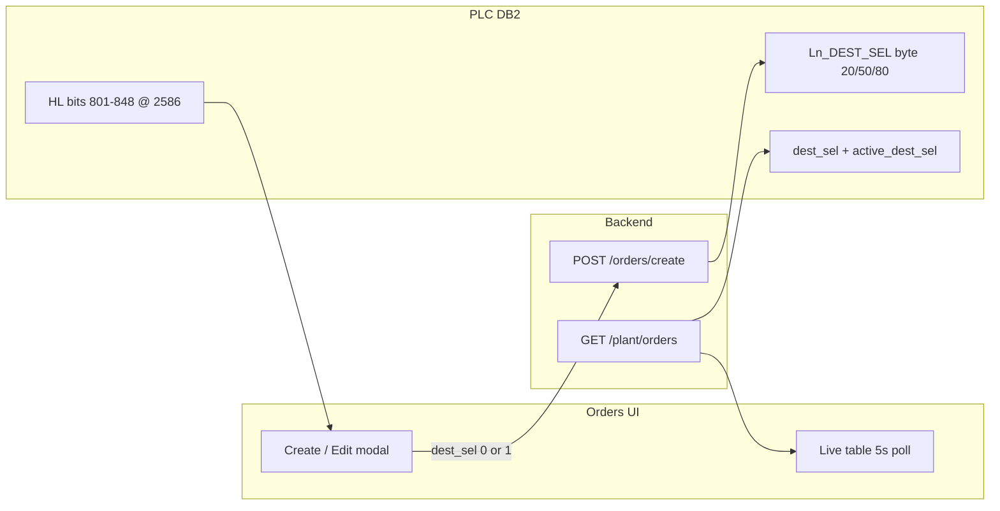

# Outloading live orders — update summary

This document describes changes made for **Outloading lines 1–3** on the Orders page: destination selection (Bulk / Packing), silo dropdown rules (high/low bins), and a live-table display fix for Bulk (`0`).

**Date context:** Implemented per plant request (Taher / operations chat).  
**Scope:** Frontend primary; backend PLC mapping was already present.

---

## 1. Business requirements (from plant)

### 1.1 Destination selection (`dest_sel`)

When creating an outloading order, the operator must choose where material is routed:

| UI label | Value sent to API / PLC | Meaning |
|--------|-------------------------|---------|
| **Bulk** | `0` | Bulk destination |
| **Packing** | `1` | Packing destination |

This applies to **all three** outloading tabs: Outloading 1, 2, and 3.

### 1.2 Destination silo dropdowns

For outloading **destination silo 1 / 2** pickers:

1. Show **high-level silos only** (silo numbers **801–824**).
2. **Do not** hide a high silo because **its own** high-level sensor (`hl_active` on that silo) is on — that was the previous bug.
3. **Do** hide a high silo when the **paired low bin** is “low level active” (read from the low silo’s `hl_active` on DB2).
4. Low-tier silos (**825–848**) must **never** appear as selectable destinations.

**Assumed pairing (confirm on site with operations if behaviour differs):**

- High silo `N` (801–824) ↔ Low silo `N + 24` (825–848), e.g. **801 ↔ 825**.

Constants live in `frontend-package/client/src/utils/outloadingSilos.ts` (`OUTLOADING_LOW_OFFSET = 24`).

---

## 2. PLC / database mapping (no backend code change required)

Outloading uses **Siemens DB2**. Tags are defined in `Backend/routes/plc_routes.py` (hardcoded map).

### 2.1 Write on order create — `DEST_SEL`

| Line | PLC tag | DB | Type | Byte offset (write) | Values |
|------|---------|-----|------|---------------------|--------|
| 1 | `L1_DEST_SEL` | DB2 | INT | **20** | 0 = Bulk, 1 = Packing |
| 2 | `L2_DEST_SEL` | DB2 | INT | **50** | 0 = Bulk, 1 = Packing |
| 3 | `L3_DEST_SEL` | DB2 | INT | **80** | 0 = Bulk, 1 = Packing |

Backend write (already existed):

```python
f"L{line}_DEST_SEL": p.get("dest_sel", 0)  # default Bulk if omitted
```

API: `POST {PLC_BASE_URL}/orders/create` with body:

```json
{
  "order_type": "outloading",
  "line": 1,
  "dest_sel": 0,
  "badge_no": "...",
  "material_code": "...",
  "declared_qty_kg": 500,
  "dest1": 802,
  "dest2": 804
}
```

### 2.2 Read for live orders table

| Line | Tag | Byte offset (read) | Purpose |
|------|-----|----------------------|---------|
| 1 | `L1_DEST_SEL` | (write area, same as above) | Programmed selection |
| 1 | `L1_ACTIVE_DEST_SEL` | **2608** | Active selection while running |
| 2 | `L2_ACTIVE_DEST_SEL` | **2620** | Same |
| 3 | `L3_ACTIVE_DEST_SEL` | **2632** | Same |

`/plant/orders` builds outloading rows via `_intake_row()` in `plc_routes.py`, exposing:

- `dest_sel`
- `active_dest_sel`

See also **§8.2** in [ORDER_COMPLETE_AND_PLC_MONITORING.md](../ORDER_COMPLETE_AND_PLC_MONITORING.md).

### 2.3 Silo HL / LOCK bits (801–848)

- Start byte **2586**, 2 bits per silo (HL, then LOCK).
- Exposed on `/silos` as `hlActive` → frontend `hl_active`.
- There is **no separate `ll_active`** field; “low level active” for a **high** silo is inferred from **`hl_active` on the paired low silo** (`N + 24`).

---

## 3. Files changed

| File | Change |
|------|--------|
| `frontend-package/client/src/utils/outloadingSilos.ts` | **New** — pairing constants, selectable rules, labels |
| `frontend-package/client/src/pages/water-system/Orders.tsx` | UI, filters, API payload, live table, edit modal |
| `ORDER_COMPLETE_AND_PLC_MONITORING.md` | Documented `DEST_SEL` offsets and UI silo rules |
| `docs/OUTLOADING_ORDERS_UPDATE.md` | This document |

**Not changed:** `Backend/routes/plc_routes.py` logic for writing `dest_sel` (already correct).

---

## 4. Frontend implementation detail

### 4.1 New utility: `outloadingSilos.ts`

| Export | Role |
|--------|------|
| `OUTLOADING_HIGH_MIN` / `MAX` | 801–824 |
| `OUTLOADING_LOW_OFFSET` | 24 (pairing) |
| `isOutloadingTab()` | `outloading-1` \| `2` \| `3` |
| `isOutloadingHighSilo()` | Silo in 801–824 |
| `isPairedLowLevelActive()` | Low bin `N+24` has `hl_active` |
| `isOutloadingSiloSelectable()` | Lock + high-only + not low-active |
| `isSiloSelectableForOrder()` | Outloading vs intake/bulk/pit rules |
| `getOutloadingSiloStatusSuffix()` | Dropdown hint: Locked / Low level active / Available |
| `formatDestSelLabel()` | `0` → Bulk, `1` → Packing, else `-` |

### 4.2 Create order modal (`Orders.tsx`)

- **Field added:** `Destination (Bulk / Packing)` (`destSel`), select: Bulk = `"0"`, Packing = `"1"`.
- **Default:** Opening “Add Order” on an outloading tab sets `destSel: '0'` (Bulk).
- **Validation:** `dest_sel` must be `0` or `1` before submit.
- **`payloadFor`:** For `orderType === 'outloading'`, always sends `dest_sel: toNum(item.destSel ?? 0)`.

### 4.3 Live orders table

- **New column:** **Dest. Selection** on Outloading 1 / 2 / 3 tables.
- **Display:** `formatDestSelLabel(item.destSel)`.

**Bug fix (Bulk showed as `-`):**

```ts
// Before (wrong — 0 is falsy in JavaScript):
destSel: plcOrder.dest_sel || '',

// After:
destSel: plcOrder.dest_sel ?? plcOrder.active_dest_sel ?? '',
```

When PLC returns `dest_sel: 0`, the table now shows **Bulk** instead of **-**. If programmed `dest_sel` is null, UI falls back to `active_dest_sel`.

### 4.4 Destination silo dropdowns

- `getSilosForOrderType('outloading', …)` returns only silos **801–824** after ordering.
- All destination availability checks use `isSiloSelectableForOrder(silo, 'outloading', allSilos)` instead of `!silo.hl_active` for outloading.
- **Intake, bulk, pit** still use: not locked and not `hl_active` on the same silo (unchanged).

### 4.5 Edit order modal

- Bulk/Packing `<select>` when active tab is outloading.
- `handleEditSubmit` includes `dest_sel` in the update payload for outloading.
- Destination silo 1/2 filters use the same outloading rules as create.

### 4.6 Helper

- `resolveOrderTypeFromTab(activeTab)` — used for available-silo counts on labels.

---

## 5. Data flow (diagram)



---

## 6. Manual test checklist

1. **Create — Bulk:** Outloading 1, choose Bulk, create order → live table **Dest. Selection** = **Bulk** (not `-`).
2. **Create — Packing:** Choose Packing → table shows **Packing**; verify PLC/DB has `1` if you have a monitor.
3. **Silo list:** Only **801–824** in destination dropdowns; **825+** never listed.
4. **Low level active:** If low silo **825** has `hl_active`, high **801** is hidden; if only **801** has `hl_active`, **801** stays visible (when **825** not active).
5. **Intake / bulk:** Still hide silos with `hl_active` on that silo (no regression).
6. **Edit:** Change Bulk ↔ Packing on an outloading order; silo filters match create modal.
7. **Network:** In DevTools, `plant/orders` → `outloading` → line 1: confirm `"dest_sel": 0` when Bulk selected.

---

## 7. Troubleshooting

| Symptom | Likely cause | Action |
|---------|----------------|--------|
| Dest. Selection shows **-** | `dest_sel` null from PLC and no `active_dest_sel` | Recreate order after fix; confirm write tag in PLC |
| Dest. Selection showed **-** with Bulk but API had `0` | Old `dest_sel \|\| ''` bug | Fixed — refresh frontend build |
| Wrong silos in list | Pairing not `N+24` on plant | Adjust `OUTLOADING_LOW_OFFSET` / bounds in `outloadingSilos.ts` |
| Packing/Bulk not on PLC | Order created before feature or broadcast stopped | Use Add Order with new UI; start PLC broadcast |

---

## 8. Follow-up / risks

- **Pairing:** If operations uses a different high↔low map than `N + 24`, only `outloadingSilos.ts` constants need updating.
- **Separate low-level PLC bit:** If the plant adds a dedicated LL bit (not `hl_active` on low silos), backend `/silos` and `isPairedLowLevelActive()` would need extending.
- **Edit API URL:** Edit submit still posts to `http://localhost:5000/api/plc/orders/create` (pre-existing); confirm production uses `PLC_BASE_URL` if edits fail in deployment.

---

## 9. Related documentation

- [ORDER_COMPLETE_AND_PLC_MONITORING.md](../ORDER_COMPLETE_AND_PLC_MONITORING.md) — §8.2 DB2 outloading tags and offsets
- Plant chat summary: Bulk = `0`, Packing = `1`; hide low-level active silos, not high-level active; high silos only in picker
