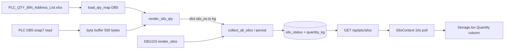

# Storage Page — Silo Quantity (DB5) Implementation Guide

This document describes **exactly** how to add a **Quantity (KG)** column on the Storage page, reading live values from **Siemens PLC DB5** using the offsets defined in `PLC_QTY_BIN_Address_List.xlsx`.

**Source file:** `PLC_QTY_BIN_Address_List.xlsx` (sheet `QTY_BIN_Struct`)  
**PLC data block:** **DB5**  
**Data type:** All quantity tags are **REAL** (4 bytes, IEEE float, typically kg)  
**Join key:** `silo_no` — the number in tag name `QTY_BIN###` must match `silo_status.silo_no` / Storage row `Silo ###`

---

## 1. What exists today

| Layer | Current behavior |
|-------|------------------|
| **Storage page** | `frontend-package/client/src/pages/water-system/Storage.tsx` — table shows material, HL, lock |
| **Data hook** | `SiloContext.tsx` — polls `GET /api/plc/silos` every **10 seconds** |
| **API** | Returns rows from PostgreSQL `public.silo_status` (not live PLC) |
| **PLC sync** | `POST /api/plc/silos/sync` reads **DB1, DB2, DB3** for material + HL/lock only |
| **DB5 qty** | **Not implemented** |

Quantity must be read on the **backend** (same pattern as material/HL), stored in `silo_status`, and exposed via the existing silos API. The frontend only displays `quantityKg` from the API.

---

## 2. Excel → PLC mapping (authoritative)

### 2.1 Sheet structure

| Column | Meaning |
|--------|---------|
| `Address` | **Byte offset** inside DB5 (use integer part, e.g. `180.0` → `180`) |
| `Name` | Tag name, format `QTY_BIN{silo_no}` |
| `Type` | Always `REAL` for quantity |
| `Comment` | Placeholder note from PLC export |

### 2.2 Offset rule

Within each contiguous block, every silo is **+4 bytes** (size of REAL):

```
DB5.DBD{offset}  →  QTY_BIN{silo_no}  (REAL, kg)
```

Example: `QTY_BIN801` at byte **180** → Siemens address `DB5.DBD180`.

### 2.3 Silo ranges covered by Excel (124 bins)

| Silo range | Count | Byte offset range | Notes |
|------------|-------|-------------------|--------|
| **101–115** | 15 | 0 – 56 | Intake / low-number bins |
| **201–203** | 3 | 60 – 68 | |
| **301–322** | 22 | 72 – 156 | |
| **601–605** | 5 | 160 – 176 | |
| **801–848** | 48 | 180 – 368 | Outloading silos (DB2 material map) |
| **901–930** | 30 | 372 – 488 | Extended storage bins |

**DB5 read size:** `max_byte = 488 + 4 = 492` → use `_needed_bytes()` ≈ **500** bytes.

### 2.4 Complete silo → offset table (from Excel)

| Silo | Offset | Tag | Silo | Offset | Tag | Silo | Offset | Tag |
|------|--------|-----|------|--------|-----|------|--------|-----|
| 101 | 0 | QTY_BIN101 | 201 | 60 | QTY_BIN201 | 601 | 160 | QTY_BIN601 |
| 102 | 4 | QTY_BIN102 | 202 | 64 | QTY_BIN202 | 602 | 164 | QTY_BIN602 |
| 103 | 8 | QTY_BIN103 | 203 | 68 | QTY_BIN203 | 603 | 168 | QTY_BIN603 |
| 104 | 12 | QTY_BIN104 | 301 | 72 | QTY_BIN301 | 604 | 172 | QTY_BIN604 |
| 105 | 16 | QTY_BIN105 | 302 | 76 | QTY_BIN302 | 605 | 176 | QTY_BIN605 |
| 106 | 20 | QTY_BIN106 | 303 | 80 | QTY_BIN303 | 801 | 180 | QTY_BIN801 |
| 107 | 24 | QTY_BIN107 | 304 | 84 | QTY_BIN304 | 802 | 184 | QTY_BIN802 |
| 108 | 28 | QTY_BIN108 | 305 | 88 | QTY_BIN305 | … | … | … |
| 109 | 32 | QTY_BIN109 | 306 | 92 | QTY_BIN306 | 846 | 360 | QTY_BIN846 |
| 110 | 36 | QTY_BIN110 | 307 | 96 | QTY_BIN307 | 847 | 364 | QTY_BIN847 |
| 111 | 40 | QTY_BIN111 | 308 | 100 | QTY_BIN308 | 848 | 368 | QTY_BIN848 |
| 112 | 44 | QTY_BIN112 | 309 | 104 | QTY_BIN309 | 901 | 372 | QTY_BIN901 |
| 113 | 48 | QTY_BIN113 | 310 | 108 | QTY_BIN310 | 902 | 376 | QTY_BIN902 |
| 114 | 52 | QTY_BIN114 | 311 | 112 | QTY_BIN311 | … | … | … |
| 115 | 56 | QTY_BIN115 | 312 | 116 | QTY_BIN312 | 929 | 484 | QTY_BIN929 |
| | | | 313 | 120 | QTY_BIN313 | 930 | 488 | QTY_BIN930 |
| | | | 314 | 124 | QTY_BIN314 | | | |
| | | | … | … | … | | | |
| | | | 322 | 156 | QTY_BIN322 | | | |

*(Full machine-readable list: generate from Excel with script in §8.)*

### 2.5 Gaps to be aware of

| Silo range | In Storage (material) | In Excel (qty) | Action |
|------------|----------------------|----------------|--------|
| **401–408** | Yes (DB3 mineral) | **No** | Show `—` for qty until Excel/PLC adds `QTY_BIN401`…`408` |
| **101–115, 201–203, 301–322, 601–605, 901–930** | May exist on DB1 / other DBs | Yes | Qty joins by `silo_no` |
| **801–848** | Yes (DB2) | Yes | Full qty support |

Join logic: `quantity_kg = qty_by_silo.get(silo_no)` — if missing, frontend shows `—`.

---

## 3. Target architecture



**Live updates:** Storage does not read PLC directly. Fresh qty appears when:

1. **Auto:** `SiloContext` polls API every 10s **after** backend has synced DB5 → Postgres.
2. **Manual:** User clicks **Sync PLC** → `POST /api/plc/silos/sync` → `fetchSilos()`.
3. **Background:** Ingestion / websocket worker (if running) calls `collect_all_silos()` → `persist_silos()`.

For **faster** qty refresh, either lower the poll interval in `SiloContext.tsx` or ensure ingestion runs on the same interval as orders.

---

## 4. Step-by-step backend changes

### 4.1 Database migration

Run once on the app Postgres database:

```sql
ALTER TABLE public.silo_status
  ADD COLUMN IF NOT EXISTS quantity_kg DOUBLE PRECISION;

-- Optional: index for reporting
CREATE INDEX IF NOT EXISTS idx_silo_status_quantity
  ON public.silo_status (quantity_kg)
  WHERE quantity_kg IS NOT NULL;
```

No change needed to `silo_status_history` unless you want qty change audit (optional).

---

### 4.2 New file: `Backend/routes/silo_qty_map.py`

Keep DB5 mapping in one place, generated from Excel (avoids a 124-line dict inside `plc_routes.py`).

```python
# Backend/routes/silo_qty_map.py
"""DB5 quantity offsets from PLC_QTY_BIN_Address_List.xlsx (sheet QTY_BIN_Struct)."""
from typing import Dict, Tuple, Any

# silo_no -> (byte_offset, type)
QTY_MAP_DB5: Dict[int, Tuple[int, str]] = {
    101: (0, "REAL"), 102: (4, "REAL"), 103: (8, "REAL"), 104: (12, "REAL"),
    105: (16, "REAL"), 106: (20, "REAL"), 107: (24, "REAL"), 108: (28, "REAL"),
    109: (32, "REAL"), 110: (36, "REAL"), 111: (40, "REAL"), 112: (44, "REAL"),
    113: (48, "REAL"), 114: (52, "REAL"), 115: (56, "REAL"),
    201: (60, "REAL"), 202: (64, "REAL"), 203: (68, "REAL"),
    301: (72, "REAL"), 302: (76, "REAL"), 303: (80, "REAL"), 304: (84, "REAL"),
    305: (88, "REAL"), 306: (92, "REAL"), 307: (96, "REAL"), 308: (100, "REAL"),
    309: (104, "REAL"), 310: (108, "REAL"), 311: (112, "REAL"), 312: (116, "REAL"),
    313: (120, "REAL"), 314: (124, "REAL"), 315: (128, "REAL"), 316: (132, "REAL"),
    317: (136, "REAL"), 318: (140, "REAL"), 319: (144, "REAL"), 320: (148, "REAL"),
    321: (152, "REAL"), 322: (156, "REAL"),
    601: (160, "REAL"), 602: (164, "REAL"), 603: (168, "REAL"), 604: (172, "REAL"),
    605: (176, "REAL"),
    **{s: (180 + (s - 801) * 4, "REAL") for s in range(801, 849)},
    **{s: (372 + (s - 901) * 4, "REAL") for s in range(901, 931)},
}

def load_qty_map(db_no: int = 5) -> Dict[str, Any]:
    if db_no != 5:
        return {"qty_map": {}, "max_byte": 0}
    max_off = max(off for off, _ in QTY_MAP_DB5.values())
    return {"qty_map": QTY_MAP_DB5, "max_byte": max_off + 4}
```

---

### 4.3 `Backend/routes/plc_routes.py`

**A. Import qty helpers** (top of file or near other silo functions):

```python
from routes.silo_qty_map import load_qty_map
```

**B. Add `render_silo_qty()`** next to `render_silos()` (~line 496):

```python
def render_silo_qty(b: bytearray, qty_map: Dict[int, Tuple[int, str]]) -> Dict[int, float]:
    """Decode REAL/INT/DINT quantities from DB5 buffer. Returns {silo_no: kg}."""
    if not _snap7_loaded:
        return {}
    out: Dict[int, float] = {}
    L = len(b)
    for silo_no, (off, typ) in qty_map.items():
        T = _norm_type(typ)
        need = 4 if T in ("REAL", "DINT") else 2 if T == "INT" else 0
        if need == 0 or off + need > L:
            continue
        try:
            if T == "REAL":
                out[silo_no] = round(get_real(b, off), 3)
            elif T == "INT":
                out[silo_no] = float(get_int(b, off))
            # elif T == "DINT": from snap7.util import get_dint; out[silo_no] = float(get_dint(b, off))
        except Exception:
            pass
    return out
```

**C. Add helper to read all DB5 qty once:**

```python
def fetch_silo_qty_from_plc() -> Dict[int, float]:
    m = load_qty_map(5)
    b = read_db_bytes(5, _needed_bytes(m))
    if not b:
        return {}
    return render_silo_qty(b, m["qty_map"])
```

**D. Debug endpoint** (optional, for integrators):

```python
@plc_bp.route("/db/5/silos-qty", methods=["GET"])
def db5_silos_qty():
    qty = fetch_silo_qty_from_plc()
    if not qty and not DEMO_MODE:
        return jsonify({"error": "PLC unreachable or DB5 absent"}), 503
    return jsonify([
        {"siloNo": k, "binName": f"Silo {k}", "quantityKg": v}
        for k, v in sorted(qty.items())
    ])
```

**E. Update `persist_silos_from_plc()`** (~line 1912):

After `rows = render_silos(...)`, load qty once and merge:

```python
qty_by_silo = fetch_silo_qty_from_plc()

for r in rows:
    silo_no = int(str(r["bin_name"]).split()[-1])
    qty = qty_by_silo.get(silo_no)  # None if not in Excel

    _app_exec("""
        INSERT INTO public.silo_status
            (silo_no, db_no, material_code, material_name, hl_active, lock_active, quantity_kg, updated_at)
        VALUES (%s, %s, %s, %s, %s, %s, %s, now())
        ON CONFLICT (silo_no) DO UPDATE SET
            db_no         = EXCLUDED.db_no,
            material_code = EXCLUDED.material_code,
            material_name = EXCLUDED.material_name,
            hl_active     = EXCLUDED.hl_active,
            lock_active   = EXCLUDED.lock_active,
            quantity_kg   = EXCLUDED.quantity_kg,
            updated_at    = now();
    """, (silo_no, db_no, mat_code, mat_name, hl, lock, qty))
```

**Important:** When syncing DB1/2/3, rows **without** a matching Excel qty should still update `quantity_kg` from DB5 when `silo_no` matches. Silos only in DB5 qty map but not in DB1/2/3 material read won't appear on Storage unless you also insert them during sync (optional enhancement).

**F. Update API responses** — `silos_from_db_under_plc_prefix()` and `api_silos()` (~lines 1988–2035):

```sql
SELECT silo_no, db_no, material_code, material_name, hl_active, lock_active, quantity_kg, updated_at
FROM public.silo_status
```

```python
"quantityKg": float(r.quantity_kg) if r.quantity_kg is not None else None,
```

---

### 4.4 `Backend/routes/silos_collect.py`

At start of `collect_all_silos()`:

```python
from routes.plc_routes import fetch_silo_qty_from_plc

def collect_all_silos(db_list=(1, 2, 3)):
    qty_by_silo = fetch_silo_qty_from_plc()
    out = []
    for db_no in db_list:
        # ... existing loop ...
            out.append({
                "silo_no": s_no,
                "db_no": db_no,
                "material_code": r.get("material_code"),
                "material_name": r.get("material_name"),
                "hl_active": bool(r.get("hl_active", False)),
                "lock_active": bool(r.get("lock_active", False)),
                "quantity_kg": qty_by_silo.get(s_no),
            })
    return out
```

---

### 4.5 `Backend/routes/silos_sink.py`

Extend upsert SQL and row dicts to include `quantity_kg`:

- Add `quantity_kg` to `SELECT` in change-detection (optional: treat qty change as history event).
- Add `quantity_kg` to `INSERT` / `ON CONFLICT DO UPDATE`.
- Pass `quantity_kg` in the `changed` list for `silo_status_history` if you want qty audit.

---

## 5. Step-by-step frontend changes

### 5.1 `frontend-package/client/src/contexts/SiloContext.tsx`

**Interface:**

```typescript
interface Silo {
  bin_name: string;
  material_code: string;
  material_name: string;
  hl_active: boolean;
  lock_active: boolean;
  quantity_kg?: number | null;  // NEW
  dbSource: string;
  dbType: string;
  silo_no?: number;
}
```

**In each `.map()` block** (db1/db2/db3):

```typescript
quantity_kg: silo.quantityKg ?? null,
```

No new API URL — same `GET ${PLC_BASE_URL}/silos`.

**Live refresh:** Already `setInterval(fetchSilos, 10000)`. After backend stores qty, UI updates within 10s. To match “live” feel, reduce to `5000` ms or sync qty in the same ingestion tick as orders.

---

### 5.2 `frontend-package/client/src/pages/water-system/Storage.tsx`

**A. Table header** (after Material Code):

```tsx
<TableHead className="text-white light:text-gray-900 font-semibold">
  Quantity (KG)
</TableHead>
```

**B. Table cell** (inside `filteredSilos.map`):

```tsx
<TableCell className="text-slate-300 light:text-gray-700 tabular-nums">
  {silo.quantity_kg != null
    ? silo.quantity_kg.toLocaleString(undefined, {
        maximumFractionDigits: 1,
        minimumFractionDigits: 0,
      })
    : "—"}
</TableCell>
```

**C. Optional KPI** (total inventory):

```typescript
const totalQtyKg = allSilos.reduce(
  (sum, s) => sum + (s.quantity_kg ?? 0),
  0
);
```

Add a `KPICard` titled e.g. `TOTAL INVENTORY` with `totalQtyKg.toLocaleString()`.

**D. Sync PLC button** — no change; existing flow already calls `POST /api/plc/silos/sync` then `fetchSilos()`. Once backend merges DB5, button refreshes qty too.

---

## 6. How silo numbers link together

```
Excel tag QTY_BIN824  →  silo_no = 824  →  DB5 byte offset 272
Storage row "Silo 824" (DB2)  →  silo_no 824  →  quantity_kg from qty_by_silo[824]
```

Parsing rule (backend):

```python
import re
m = re.match(r"QTY_BIN(\d+)", "QTY_BIN824")
silo_no = int(m.group(1))  # 824
```

Storage displays `silo.bin_name` (`"Silo 824"`) and `silo.quantity_kg` from the same `silo_no`.

---

## 7. Testing checklist

| Step | Command / action | Expected |
|------|------------------|----------|
| 1 | `GET /api/plc/db/5/silos-qty` | JSON list of 124 silos with `quantityKg` from live PLC |
| 2 | `POST /api/plc/silos/sync` | `total_upserts` > 0, no DB5 error in `results` |
| 3 | `GET /api/plc/silos` | Each row has `quantityKg` where silo exists in Excel |
| 4 | Storage → **Sync PLC** | Quantity column fills after sync |
| 5 | Wait 10s | Values refresh if PLC/ingestion updates Postgres |
| 6 | Silo **401** (DB3) | `quantityKg: null` / UI `—` (not in Excel yet) |
| 7 | Silo **801** (DB2) | `quantityKg` matches PLC `DB5.DBD180` |

**PLC spot-check (TIA / watch table):**

- `QTY_BIN801` = `DB5.DBD180` (REAL)
- `QTY_BIN848` = `DB5.DBD368` (REAL)
- `QTY_BIN101` = `DB5.DBD0` (REAL)

---

## 8. Regenerate `QTY_MAP_DB5` from Excel

When the Excel file changes, re-run:

```python
import re
import pandas as pd

df = pd.read_excel("PLC_QTY_BIN_Address_List.xlsx", sheet_name="QTY_BIN_Struct")
for _, r in df.iterrows():
    name = str(r.get("Name") or "")
    m = re.match(r"QTY_BIN(\d+)", name)
    if not m:
        continue
    silo = int(m.group(1))
    off = int(float(r["Address"]))
    print(f"    {silo}: ({off}, \"REAL\"),")
```

Paste output into `silo_qty_map.py`.

---

## 9. Files to create or modify (summary)

| File | Action |
|------|--------|
| `docs/STORAGE_SILO_QTY_IMPLEMENTATION.md` | This guide |
| `Backend/routes/silo_qty_map.py` | **Create** — Excel offsets |
| `Backend/routes/plc_routes.py` | `render_silo_qty`, `fetch_silo_qty_from_plc`, API + persist |
| `Backend/routes/silos_collect.py` | Merge DB5 qty into collect |
| `Backend/routes/silos_sink.py` | Persist `quantity_kg` |
| SQL migration | `ALTER TABLE silo_status ADD quantity_kg` |
| `frontend-package/client/src/contexts/SiloContext.tsx` | `quantity_kg` field |
| `frontend-package/client/src/pages/water-system/Storage.tsx` | Quantity column (+ optional KPI) |

---

## 10. Implementation order (recommended)

1. Run SQL migration (`quantity_kg` column).
2. Add `silo_qty_map.py` with Excel offsets.
3. Add `render_silo_qty` + `fetch_silo_qty_from_plc` + debug route.
4. Update `silos_collect.py` + `silos_sink.py` + `persist_silos_from_plc`.
5. Update `GET /api/plc/silos` response.
6. Update `SiloContext.tsx` then `Storage.tsx`.
7. Test with `GET /api/plc/db/5/silos-qty` before UI.
8. Confirm live refresh via Sync PLC + 10s poll.

---

*Generated from `PLC_QTY_BIN_Address_List.xlsx` (sheet `QTY_BIN_Struct`, 124 QTY_BIN tags, all REAL, DB5). Update this doc when the Excel export changes.*
